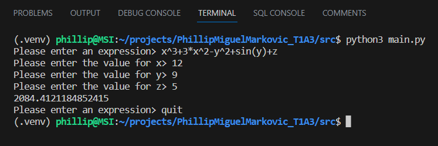
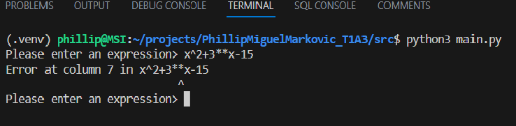

# PhillipMiguelMarkovic_T1A3

# References

https://www.tutorialspoint.com/coding-standards-style-guide-for-python-programs

https://peps.python.org/pep-0008/

# Link to Source Control Repository

https://github.com/phillipm-developer/PhillipMiguelMarkovic_T1A3

# Code Style Guide

The expression evauator teminal application adheres to the PEP8 coding standards document (Python Enhancment Proposal 8).

The following standards were employed in the terminal application code during it's implementation.

## Naming of Collections

At no point does the code use individual letters or names that lack any meaning. All variables regardless of scope use semantically meaningful names, even if the variable names are lengthy. This applies to collection classes (lists, tuples & dictionaries). For example:

self.infix_list = infix_list

A locally scoped list assigned as a member variable.

calculation_dict['substitutions'] = substitutions_dict

Assigning a dictionary of substitutions (variable names and the values assigned to them) to a calculation dictionary. 

Note the use of '_list' and '_dict' to denote the data collection type and the elements they contain.

## Packages and Modules

All packages and modules are declared at the top of each source file. They all use lower case names with underscores between words to improve readability and meaning.

Where it is practical modules are imported in the following manner (known as absolute imports):

from expression import Expression 
from syntax_exception import SyntaxException 
from syntax_exception import ErrorType

This enables a developer to reference classes, their methods and other functions directly instead of specifying the module name first. This improves readability and reduces the clutter (spagetti) in the code. It also reduces performance overhead by restricting the use of a module to only those things the program requires.

Mutiple imports are done line by line for clarity. Modules are also imported in the following order:

Built-in module imports 
Thirty party module imports 
Module imports locally developed 

At no point does the terminal app use wildcards(*) in it's imports. This maintains clarity on what resoources are being imported into the namespace.

## Naming Conventions (General)

Classes are named using pascal case where the first letter of each word is capitalised e.g. class PascalCase:

Exception classes are named such that each name ends with the letters 'Error'. Here class SyntaxError inherits from Exception 
e.g. class SyntaxError(Exception)

Both function and variable names follow the same naming convention. Names are all lower case with words being separated by underscores. Private member variables and methods are prefixed with underscores to prevent direct access.

## Indenting

The code for the terminal application uses 4 spaces per indentation as per PEP8. The VSCode development environment (used to develop the terminal app), converts all tabs to spaces, so no source file ever has any tabs and therefore no mixing of tabs and spaces ever arises. This is not permitted in Python.

There are no unecessary spaces in expressions and statements.

## Comments

Comments in the terminal app are no more than 79 characters for function/method headers. They are no more than 72 characters for inline comments. If these limits are exceeded, the comment will wrap onto the next line.

The approach taken during development was to write comments as an outline (or pseudocode) of steps which mirrored the project plan. These initial comments act as headers for the various functions and methods that were created underneath them. Comments are not used for statements which are self explanatory.

# Major Features

The terminal application that was implemented is an expression evaluator designed for ease of use. It does this by providing the following major features to the general user.

## File Input and Output

The expression evaluator is capable of reading a set of data from an input file specified on the command line. This allows the app to obtain the multiple expressions to be evaluated and the corresponding variables, as well as the values to be substituted into those values.

Each record is read into a data structure called a calculation dictionary. This acts as a workspace from which the app can read the expression to evaluate and the values to substitute into the expression. Once the expression is evaluated, the result is written back into the calculation dictionary.

Once all the evaluations are carried out, the list of calculation dictionaries is then written out to a file suupplied on the command line.

The basic logical structure of a calculation dictionary is as follows:

    calculation_dict[
            {
                'equation': 'sin(x^2)+sin(x*y)-cos(y^2)', 
                'result': -2.49548102969227, 
                'solved': True, 
                'values_obtained': True, 
                'substitutions': {'x': '7', 'y': '3.5'}
            }
        ]

This is what a calculation dictionary looks like after evaluation and just before it is written to the output file.

If only an input file is supplied on the command line but no output file, then the output is displayed to screen.

If an output file is supplied without a corresponding input file an error occurs and a message is displayed in the console.

This application uses the JSON file formats for all its inputs and outputs. It is the most practical way to manage arbitrary numbers of variables. It is a data format that is supported by many programming languages and allows the data generated by this app to be transferred between systems.

## Interactive Mode

If no command line parameters are supplied to the app when it is invoked, it will enter interactive mode. This is a simple shell which accepts values. The user will be prompted for an expression which they supply being careful to make sure it is properly formatted.

The app will extract the variables from the expression, then prompt the user for a value to substitute into each variable. This information is inserted into a new calculation dictionary object which is then passed to the expression evalator part of the app for processing. It writes the result back into the dictionary. The app then retrieves this result and displays it in the console. The user is then prompted for the next expression. Here is a sample run in interactive mode:

This loop will continue until the user types 'quit' or 'exit' at the prompt, at which point the program will terminate.

If the user submits an improperly formatted expression such as an extra operator in the wrong place or a missing parentheses a syntax error (exception) is generated and an appropriate error message is displayed as in the following run:

## Support for Unlimited Variables

The expression evaluator terminal app supports any number of variables with user defined names in expressions.

e.g. 3*x+4*(a-dog)-10*sin(cat)

The app converts the string expression into a list of tokens called an infix list, where each token becomes an operator or operand. Each operand is either a number or variable.

The expression evaluator component has a method which extracts the variables out of an expression and creates 'substitutions_dict' dictionary which is then inserted into the parent calculation dictionary. In this case:

[{'x' : 'NONE', 'a' : 'NONE', 'dog' : 'NONE', 'cat' : 'NONE'}]

The values are set later, but prior evaluation.

## Image File of Plotted Function Generation

Another unique feature of this app is the ability to generate an image file which is created in the current working directory of the program. The user specifies the -png option followed by the expression you wish to plot.

Internally the app will by default (unless otherwise specified) create a list of 100 values in the range -50 to 50. The app will then use the expression submitted on the command line to evaluate each value to produce a list of 100 results. The results are plotted against the initial values. A Portable Network Graphic (PNG) file is generated and stored to the file system.

Here is a sample png image for the function y = x^2 generated by the app:

This is accomplished by using a popular third party package called matplotlib. Matplotlib is a plotting library for creating mathematical visualizations.

Each image is generated with its own unique file name. This was achieved by using the built-in module datetime. The file name consists of day, month, year, hr, min, sec and microsecond. This ensures unique filenames are consistently created even if the images are generated in quick succession. The file name for image displayed above is called Figure_2023-5-10_16-24-39:372930.png.

# Implementation Plan

# User Guide

## Installation

## Dependencies

## System Requirements

## Usage

