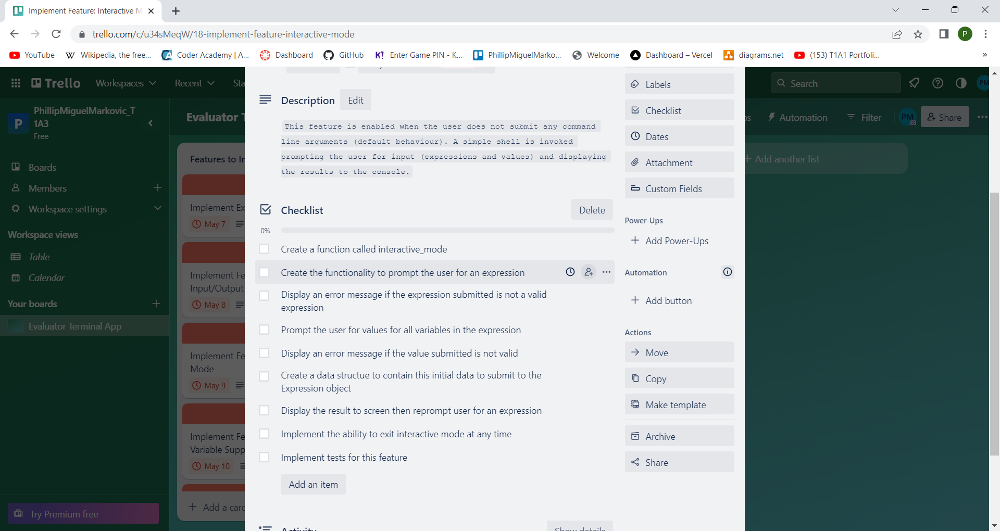

# PhillipMiguelMarkovic_T1A3

# References

Diwan A. 2022, <i>Tutorialspoint</i>, 'Coding standards (style guide) for Python programs?', accessed 10 May 2023, <https://www.tutorialspoint.com/coding-standards-style-guide-for-python-programs>

Rossum G, Warsaw B, Coghlan N. 2001, <i>Python Enhancement Proposals</i>, 'PEP 8 – Style Guide for Python Code', accessed 10 May 2023, https://peps.python.org/pep-0008/

<i>Coder Academy</i>, 'Frequently Asked Questions', accessed 10 May 2023, https://www.coderacademy.edu.au/faq

# Link to Source Control Repository

https://github.com/phillipm-developer/PhillipMiguelMarkovic_T1A3

# Link to Trello Workspace

https://trello.com/b/E3EoGLMn/evaluator-terminal-app

# Link to Slide Deck Presentation

https://youtu.be/WaX0oFMU8HI

# Note About Testing

Please note, there are 2 pytest scripts which cover R15 of the Code Requirements. 

The unit tests for the Expression class can be run with the following command:

pytest test_expression.py</spon>

The tests that check actual features can be run with the following command:

pytest test_features.py

An explanation of each of the unit and feature tests is in the comments above each 'test_' function.

# Code Style Guide

The expression evauator teminal application adheres to the PEP8 coding standards document (Python Enhancment Proposal 8).

The following standards were employed in the terminal application code during it's implementation.

## Naming of Collections

At no point does the code use individual letters or names that lack any meaning. All variables regardless of scope use semantically meaningful names, even if the variable names are lengthy. This applies to collection classes (lists, tuples & dictionaries). For example:

self.infix_list = infix_list

A locally scoped list assigned as a member variable.

calculation_dict['substitutions'] = substitutions_dict  

Assigning a dictionary of substitutions (variable names and the values assigned to them) to a calculation dictionary. 

Note the use of '_list' and '_dict' to denote the data collection type and the elements they contain. An exception is made in the case of lists which are handled as if they were stacks, where the last element is either checked or popped off and returned. The suffix '_stack' is used instead of '_list'.

## Packages and Modules

All packages and modules are declared at the top of each source file. They all use lower case names with underscores between words to improve readability and meaning.

Where it is practical modules are imported in the following manner (known as absolute imports):

from expression import Expression 
from syntax_exception import SyntaxException 
from syntax_exception import ErrorType

This enables a developer to reference classes, their methods and other functions directly instead of specifying the module name first. This improves readability and reduces the clutter (spagetti) in the code. It also reduces performance overhead by restricting the use of a module to only those things the program requires.

Mutiple imports are done line by line for clarity. Modules are also imported in the following order:

* Built-in module imports
* Thirty party module imports
* Module imports locally developed 

At no point does the terminal app use wildcards(*) in it's imports. This maintains clarity on what resources are being imported into the namespace.

## Naming Conventions (General)

Classes are named using pascal case where the first letter of each word is capitalised e.g. class PascalCase:

Exception classes are named such that each name ends with the letters 'Error'. Here class SyntaxError inherits from Exception 
e.g. class SyntaxError(Exception)

Both function and variable names follow the same naming convention. Names are all lower case with words being separated by underscores. Private member variables and methods are prefixed with underscores to prevent direct access.

## Indenting

The code for the terminal application uses 4 spaces per indentation as per PEP8. The VSCode development environment (used to develop the terminal app), converts all tabs to spaces, so no source file ever has any tabs and therefore no mixing of tabs and spaces ever arises. This is not permitted in Python.

There are no unecessary spaces in expressions and statements.

## Comments

Comments in the terminal app are no more than 79 characters for function/method headers. They are no more than 72 characters for inline comments. If these limits are exceeded, the comment will wrap onto the next line.

The approach taken during development was to write comments as an outline (or pseudocode) of steps which mirrored the project plan. These initial comments act as headers for the various functions and methods that were created underneath them. Comments are not used for statements which are self explanatory.

# Major Features

The terminal application that was implemented is an expression evaluator designed for ease of use. It does this by providing the following major features to the general user.

## File Input and Output

The expression evaluator is capable of reading a set of data from an input file specified on the command line. This allows the app to obtain multiple expressions to be evaluated and the corresponding variables, as well as the values to be substituted into those variables.

Each record is read into a data structure called a calculation dictionary (calculation_dict). This acts as a workspace from which the app can read the expression to evaluate and the values to substitute into the expression. Once the expression is evaluated, the result is written back into the calculation dictionary.

Once all the evaluations are carried out, the list of calculation dictionaries is then written out to a file supplied on the command line.

The basic logical structure of a calculation dictionary is as follows:

    calculation_dict[
            {
                'equation': 'sin(x^2)+sin(x*y)-cos(y^2)', 
                'result': -2.49548102969227, 
                'solved': True, 
                'values_obtained': True, 
                'substitutions': {'x': '7', 'y': '3.5'}
            }
        ]

This is what a calculation dictionary looks like after evaluation and just before it is written to the output file.

If only an input file is supplied on the command line but no output file, then the output is displayed to screen.

If an output file is supplied without a corresponding input file an error occurs and a message is displayed in the console.

This application uses the JSON file formats for all its inputs and outputs. It is the most practical way to manage arbitrary numbers of variables. It is a data format that is supported by many programming languages and allows the data generated by this app to be transferred between systems.

## Interactive Mode

If no command line parameters are supplied to the app when it is invoked, it will enter interactive mode. This is a simple shell which accepts expressions and values. The user will be prompted for an expression which they supply being careful to make sure it is properly formatted.

The app will extract the variables from the expression, then prompt the user for a value to substitute into each variable. This information is inserted into a new calculation dictionary object which is then passed to the expression evalator part of the app for processing. It writes the result back into the dictionary. The app then retrieves this result and displays it in the console. The user is then prompted for the next expression. Here is a sample run in interactive mode:

    phillip@MSI:~/projects/PhillipMiguelMarkovic_T1A3/src$ ./evaluate.sh
    Please enter an expression> x^3+3*x^2-y^2+sin(y)+z
    Please enter the value for x> 12
    Please enter the value for y> 9
    Please enter the value for z> 5
    2084.4121184852415
    Please enter an expression> quit
    phillip@MSI:~/projects/PhillipMiguelMarkovic_T1A3/src$

This loop will continue until the user types 'quit' or 'exit' at the prompt, at which point the program will terminate.

If the user submits an improperly formatted expression such as an extra operator in the wrong place or a missing parentheses a syntax error (exception) is generated and an appropriate error message is displayed as in the following run:

    phillip@MSI:~/projects/PhillipMiguelMarkovic_T1A3/src$ ./evaluate.sh
    Please enter an expression> x^2+3**x-15
    Error at column 7 in x^2+3**x-15
                               ^
    Please enter an expression>

## Support for Unlimited Variables

The expression evaluator terminal app supports any number of variables with user defined names in expressions.

e.g. 3\*x+4\*(a-dog)-10\*sin(cat)

The app converts the string expression into a list of tokens called an infix list, where each token becomes either an operator or operand. Each operand is either a number or a variable.

The expression evaluator component has a method which extracts the variables out of an expression and creates a 'substitutions_dict' dictionary which is then inserted into the parent calculation dictionary. In this case:

[{'x' : 'NONE', 'a' : 'NONE', 'dog' : 'NONE', 'cat' : 'NONE'}]

The values are set later, but prior to evaluation.

## Image File Generation of Plotted Function

Another unique feature of this app is the ability to generate an image file which is created in the current working directory of the program. The user specifies the -png option followed by the expression they wish to plot.

Internally the app will by default (unless otherwise specified) create a list of 200 values in the range -100 to 100. The app will then use the expression submitted on the command line to evaluate each value to produce a list of 100 results. The results are plotted against the initial values. A Portable Network Graphic (PNG) file is generated and stored to the file system.

Here is a sample png image for the function y = x^2 generated by the app:

This is accomplished by using a popular third party package called matplotlib. Matplotlib is a plotting library for creating mathematical visualizations.

Each image is generated with its own unique file name. This was achieved by using the built-in module datetime. The file name consists of day, month, year, hour, minute, second and microsecond. This ensures unique filenames are consistently created even if the images are generated in quick succession. The file name for image displayed above is called 
Figure_2023-5-10_16-24-39:372930.png.

# Implementation Plan

The following is an implementation plan for the development of the evaluate terminal appliation. This plan is divided up into the portion of the application that drives it behind the scenes (core), and the features the application offers its users.

The Expression class is the largest and most complex part of the application. It is the component that embodies the expression and evaluates the expression based on user and file input. The features which are visible to the user are built on top of the Expression class, and many more features could likewise be added.

Implementation of the Expression class is divided up into tasks and sub tasks. The Expression class can be treated as an independant feature in the context of this project plan.

## Feature: Expression Class Checklist

Development of the Expression class tasks can be split up on a per method basis. Each method can be implemented independently and run with unit tests until it is time to merge the code into the repository. However the team is only comprised of one developer. The output of each method serves as the input to the next method in the tasklist below. You cannot implement 'create_postfix_list' without first implementing 'create_infix_list' to provide the input parameters.

The only exception to this is the 'check_syntax' method which is called by 'create_infix_list' to check the correctness of the expression string supplied by the user. There is some crossover here and the developer would be better suited to developing the 'check_syntax' method after 'create_infix_list' and inserting a call to this method into 'create_infix_list' at the appropriate point.

All tasks here have an equal high priority as all of the user facing features rely on these tasks being implemented up front.

1) Develop 'create_infix_list' method, associated utility methods, error handling and unit tests

    This task has 3 essential stages or sub-tasks:
    - Tokenize the user defined expression string
    - Check the correctness of the tokens in the list (check_syntax method)
    - Insert unary minus where required in this list of tokens  

    Duration: 1 day 
    Priority: High

2) Develop 'check_syntax' method, associated utility methods, error handling and unit tests

    Duration: 1 day 
    Priority: High

3) Develop 'create_postfix_list', associated utility methods, error handling and unit tests

    Duration: 1 day 
    Priority: High

4) Develop 'evaluate' method, associated utility methods, error handling and unit tests

    Duration: 6 hours 
    Priority: High

5) Develop evaluate calculation dictionary (evaluate_calc_dict) method, associated utility methods, error handling and unit tests

    Duration: 1 day 
    Priority: High

## Feature: File Input/Output Checklist

This feature is incorporated into the application to allow users to draw input data from a file of their choosing. Once all the expressions in the input file have been evaluated, the results are either displayed to screen written to a file at the users discretion.

The following tasks should be executed in the order specified as each task depends on the previous one. This feature is given high priority because it is the minimum requirement for this appliacation to be viable (MVP).

1) Create a series of input files for testing and general use (in the JSON format)

2) Create the functionality to process an input file specified as a command line option

3) Create a function to open and read the file

4) Create the functionality to process input file content into the required format for the Expression class to then evaluate.

5) Create the functionality to display the results to the console

6) Create the functionality to process an output file specified as a command line option

7) Create a function to write the results to an output file in JSON format

8) Ensure error handling is implemented for each of the 7 previous tasks e.g. ouptut files cannot be specified without a corresponding input file

9) Implement tests for this feature.

Duration: 1 day 
Priority: High

## Feature: Interactive Mode Checklist

This feature is enabled when the user does not submit any command line arguments (default behaviour). A simple shell is invoked prompting the user for input (expressions and values) and displaying the results to the console.

This feature should only be implemented once file processing has been developed, hence its medium priority.

1) Create a function called interactive_mode

2) Create the functionality to prompt the user for an expression

3) Display an error message if the expression submitted is not a valid expression

4) Prompt the user for values for all variables in the expression

5) Display an error message if the value submitted is not valid

6) Create a data structue (calculation dictionary) to contain this initial data to submit to the Expression object. The result is written to the structure and passed back.

7) Display the result to screen then reprompt user for an expression

8) Implement the ability to exit interactive mode at any time

9) Implement tests for this feature

Duration: 1 Day 
Priority: Medium

## Feature: Unlimited Variable Support Checklist

The application does not need to support this feature to be viable. It could have been restricted to using single variable expressions. This would not need any of the tasks here to be carried out, hence the low priority. 

1) Create a method in Expression that extracts the variables from the expressions and returns a dictionary of unset variables

2) Implement the functionality required to obtain values from a file for those variables

3) Implement the functionality required to obtained values from a user to set those variables

4) Create the functionality to set the values of those variables in the same dictionary

5) Implement error handling to ensure the values provided are valid

6) Implement tests for this feature 

Duration: 6 Hours 
Priority: Low

## Feature: Image File Generation Checklist

Once implemented, this feature allows users to visualize their expressions.

1) Implement the functionality to process the equation to be plotted and saved as a command line argument. The equation is submitted on the command line.

2) Write a function to plot and save the function as an image file in PNG format

3) Restrict expressions to single variables, otherwise it cannot be plotted on a 2D cartesian plane.

4) Write a method in the Expression class to do a bulk evaluate on a list of values and return a list of results.

5) Implement a scheme for creating unique filenames using the python built-in module 'datetime'.

6) Implement error handling and display appropriate error messages. 

7) Implement tests for this feature

Duration: 6 Hours
Priority: Low

There is approximately 7 days of work in total to carry out the implementation plan.

## Trello Task Board

Trello is the project management platform selected to track this implementation plan. The following screen shots show how the implementation plan has been recorded in Trello, and how it has been updated as development has progressed.

# User Guide

## Installation

The following files are required for the general user to run the evaluate terminal application:

* evaluate.sh
* main.py
* parse_cmd_line.py
* expression.py
* syntax_exception.py
* math_exception.py
* plot_equation.py
* input.json

These files are available in PhillipMiguelMarkovic_T1A3.zip. Create or choose a designated folder for the app, then extract these files from the archive into the folder.

## Dependencies

These files require Python 3.10 or higher, and the python modules pytest and matplotlib. Run the evaluate app from your Linux or WSL (Windows Subsystem for Linux) terminal in the following manner. Move into your nominated directory and run the following:

./evaluate.sh

As part of the initial setup it checks for these dependencies and will display an error to the console advising the user which dependencies are not available. If all 3 are installed the evaluate app will start up in interactive mode.

## System Requirements

Windows 10 or 11 running Windows Subsystem for Linux (WSL).

Alternatively you can use Linux (preferably Ubuntu).

Desktop PC or laptop. I recommend that the hardware be no older than 2019 as this is the specification recommended by Coder Academy to their cohorts for their courses (Coder Academy FAQ n.d.). This app was developed and tested on an MSI 13th Gen Intel(R) Core(TM) i7-13620H 2.40 GHz laptop so the hardware requirement is reasonable.

So to summarize more specifically, the minimum requirements are:

Minimum Windows specifications
* 16GB RAM
* No more than 4 years old
* Supports Windows 10 or 11  

Minimum Mac specifications:

* 16GB RAM
* No more than 4 years old
* OS Big Sur (minimum)

The Mac specification is provided as everyone has different preferences and users may want to run the terminal app on their Mac. The functionality of the app is not guaranteed and the evaluate shell script is unlikely to run on a Mac.

## Usage

The following instructions demonstrate how to use the terminal application with the available comand line options:

./evaluate.sh

If the application is invoked without any arguments supplied on the command line, the terminal app will enter interactive mode. The user is provided with a simple shell and is prompted to supply expressions with variables. The app will then prompt the user for values for each of the variables in the expression. Once the last value is supplied, the expression is evaluated and the result is displayed as shell output. The user is then prompted for the next expression.

    phillip@MSI:~/projects/PhillipMiguelMarkovic_T1A3/src$ ./evaluate.sh 
    Please enter an expression> x^2
    Please enter the value for x> 3
    9.0
    Please enter an expression> -x^2
    Please enter the value for x> 3
    9.0
    Please enter an expression> -x^3
    Please enter the value for x> 3
    -27.0
    Please enter an expression> -sin(x)
    Please enter the value for x> 3
    -0.1411200080598672
    Please enter an expression> quit
    phillip@MSI:~/projects/PhillipMiguelMarkovic_T1A3/src$

The user can type 'quit' or 'exit' at any time to exit the program.

./evaluate.sh -i input.json

The user can invoke the program by specifying the -i command line option and providing the json file as the input paarameter. The app will then open the file and read the input data on each line. The expression, input values and results are then displayed in the console.

    phillip@MSI:~/projects/PhillipMiguelMarkovic_T1A3/src$ ./evaluate.sh -i input.json 
    EXPR: x^2+2*x+1, VARS: x=5, RESULT: 36.0
    EXPR: -sin(x)-cos(x)+sin(3*x), VARS: x=10, RESULT: 0.3950610158729603
    EXPR: 2*x^3+5*x^2-3*x+10, VARS: x=12, RESULT: 4150.0
    EXPR: 2*x^3+5*x^2-3*x+10, VARS: x=15, RESULT: 7840.0
    EXPR: 2*x^3+5*x^2-3*x+10, VARS: x=20.5, RESULT: 19280.0
    EXPR: sin(x^2)+sin(x)-cos(x), VARS: x=7, RESULT: -1.0506683083839874
    EXPR: sin(x^2)+sin(x*y)-cos(y^2), VARS: x=7, y=3.5, RESULT: -2.49548102969227
    phillip@MSI:~/projects/PhillipMiguelMarkovic_T1A3/src$

./evaluate.sh -i output.json -o output.json

By providing and additional parameter -o followed by the output file name, the results of the bulk evaluations will be written to the output file in the current working directory. The results will not be displayed to the console.

./evaluate.sh -o output.json

Supplying and output file without a corresponding input file is not permitted and an error message will be displayed.

    phillip@MSI:~/projects/PhillipMiguelMarkovic_T1A3/src$ ./evaluate.sh -o output.json 
    You must provide a corresponding input file '-i' in order to write to output.json
    phillip@MSI:~/projects/PhillipMiguelMarkovic_T1A3/src$

./evaluate.sh -png "3*x^3-x+10"

The -png option allows the user to specify an equation for the purpose of plotting it on an x-y axis and saving it as an image file to the current working directory. Please ensure you enclose the equation in quotes when declaring it on the command line.

    phillip@MSI:~/projects/PhillipMiguelMarkovic_T1A3/src$ ./evaluate.sh -png "x^2"
    The figure has been saved to Figure_2023-5-11_22-53-20:30463.png
    phillip@MSI:~/projects/PhillipMiguelMarkovic_T1A3/src$

There is no need to specify an output filename. It is automaticallly generated by the application.
